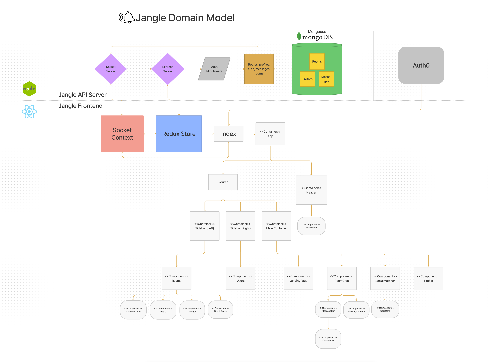

# Software Requirements

## Vision

We want to create an application that will allow users with unique interests, identities, and/or animal kingdom classifications to connect with each other.

## Scope (In/Out)

IN - _Our app will do the following_

- Allow users to communicate via public and private rooms in real time
- Allow users to participate in 1-1 messaging in real time
- Provide a matching feature that allows people to match with other users that have similar interests in order to start a 1-1 conversation
- The app will provide basic CRUD functionality
- Socket emit events will be triggered by numerous types of frontend user interactions
- Sign up using base64 authentication
- Sign in using JWT authorization (admin users will use JWT authorization for administrative actions)

OUT - _Our app will not do the following_

- File sharing capabilities
- Voice chatting capabilities
- Video chatting capabilities
- Any type of location services

### Minimum Viable Product

- Users shall be able to create accounts and login
- Users shall be able to join public rooms
- Users shall be able to create private rooms that any user can join with the proper credentials
- Users can engage in 1-1 messaging with other users
- Users can match with other users that have similar interests, as specified during account creation

### Stretch Goals

- allow users to add a custom profile photo (cloudinary?)
- add ability to edit user persona
- add ability for users to edit/delete their own created private channels
- assign random image to users upon signup
- add admin ability to create public channels
- add admin ability to delete public channels
- add admin ability to delete users
- add ability for users to add posts to a chat room's feed
- add ability to add reactions to posts (like, heart, etc)
- chat commands!
- Allow users to communicate with plain gifs and images

## Functional Requirements

- The application must allow users to sign up to create a profile and login to their profiles at a later time
- The application must feature sound security - it will implement authentication using base64, and authorization using JWT. Passwords will be stored using secure methods.
- The application will have RBAC so that admin users can execute administrative actions with the purpose of promoting a positive + safe environment for the app's users.
- The application must allow users to create, join, and participate in rooms.
- The app must have a real time event system to allow users to communicate instantaneously.

### Data Flow

Please refer to the image below for a depiction of Jangle's data flow

## Non-Functional Requirements

- Testing - app will have unit tests to ensure that
- Resizability - app will have an aesthetic appearance on any reasonably sized browser window
- Performance - Given a good internet connection, app will not lag when in use assuming a huge amount of users are not using the app at any given time
